# OpenTuneWeaver — Installation and HowToUse

This guide covers end‑to‑end setup of OpenTuneWeaver (OTW) on Runpod, launching the UI on port 8080, and running the full fine‑tuning pipeline from document upload to an exportable model (LoRA, Merged, GGUF).

---

## Table of Contents
- [Prerequisites](#prerequisites)
- [1. Provision a Runpod Pod](#1-provision-a-runpod-pod)
- [2. Open JupyterLab](#2-open-jupyterlab)
- [3. Clone the project and run setup](#3-clone-the-project-and-run-setup)
- [4. Start OTW (Port 8080)](#4-start-otw-port-8080)
- [5. Basic configuration in the UI](#5-basic-configuration-in-the-ui)
- [6. Upload documents](#6-upload-documents)
- [7. Run the pipeline](#7-run-the-pipeline)
- [8. Results and export](#8-results-and-export)
- [9. Ports, logs, and tips](#9-ports-logs-and-tips)
- [License and acknowledgments](#license-and-acknowledgments)

---

## Prerequisites
- Runpod account with a GPU pod (≥ 20 GB VRAM recommended, e.g., RTX A6000/A100).
- Hugging Face account with an Access Token (at least READ).
- HTTP ports exposed: 8888 (JupyterLab), 8080 (OTW UI), optionally 11434 (Ollama).

---

## 1. Provision a Runpod Pod
Select a recent PyTorch template (CUDA 12.x, Python 3.11). Configure adequate storage and expose the required HTTP ports.

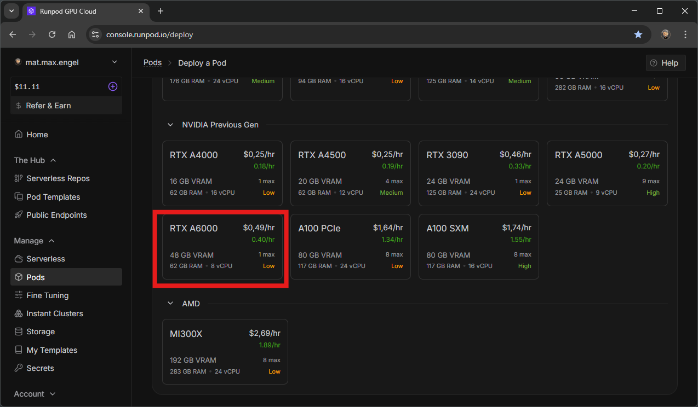
*Choose a suitable GPU/instance. I would prefer a GPU with at least 20 GB VRAM.*

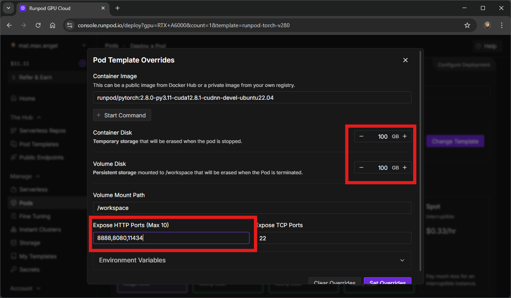
*Set Container/Volume Disk (both 100 GB) and expose ports `8888,8080,11434`.`11434` is optional, because Ollama is only for the localhost.*

---

## 2. Open JupyterLab
Start the pod and open JupyterLab from the Connect tab on port 8888.

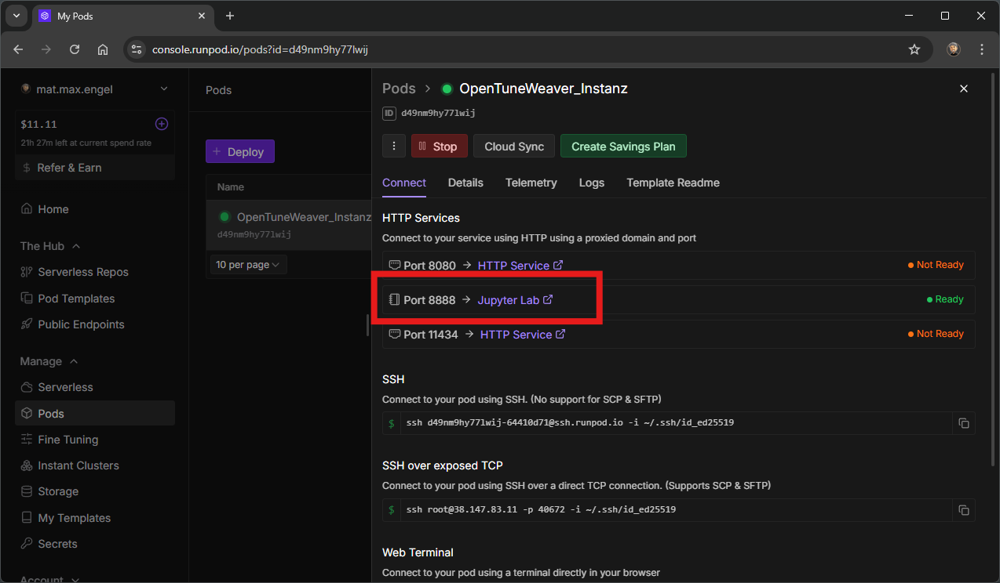
*Open JupyterLab on port 8888.*

Create a new Terminal from the Launcher.

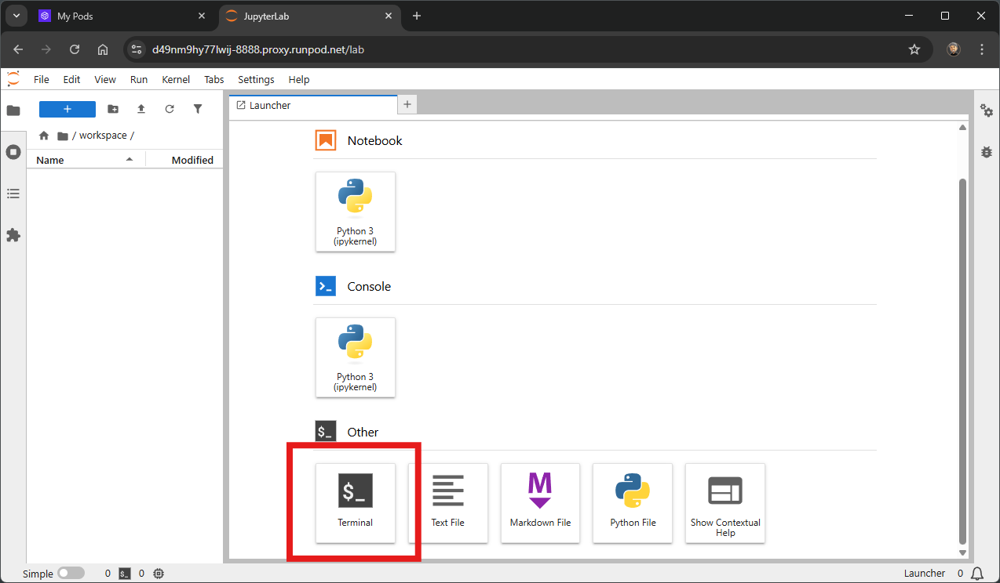
*Open a new Terminal.*

---

## 3. Clone the project and run setup
In the terminal, you are normally in the `/workspace`-location, clone the repository, and execute the setup script:

```

cd /workspace
git clone https://github.com/ProfEngel/OpenTuneWeaver.git
cp OpenTuneWeaver/setup_with_ollama.sh .
chmod +x setup_with_ollama.sh
./setup_with_ollama.sh

```

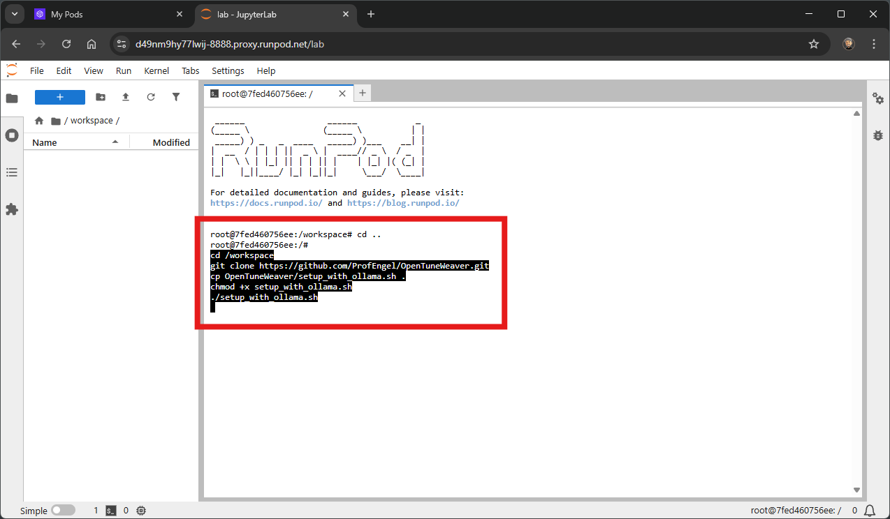
*Clone and run the setup. This usually only needs to be done once and takes between 5-15 minutes to initialize, depending on your internet connection and hardware performance.*

Wait until dependency checks and downloads complete. At the end, the script prompts to start the OTW UI.

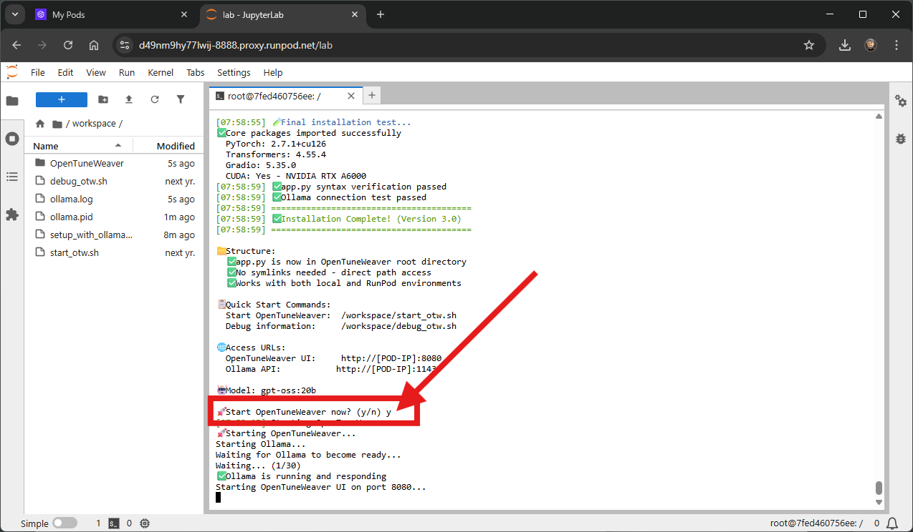
*Confirm “Start OpenTuneWeaver now? (y/n)” with `y`.*

---

## 4. Start OTW (Port 8080)
After confirmation, the UI runs on port 8080. Open it from the Connect tab via the HTTP Service link or if you installed it locally than open it from your http://localhost:8080.

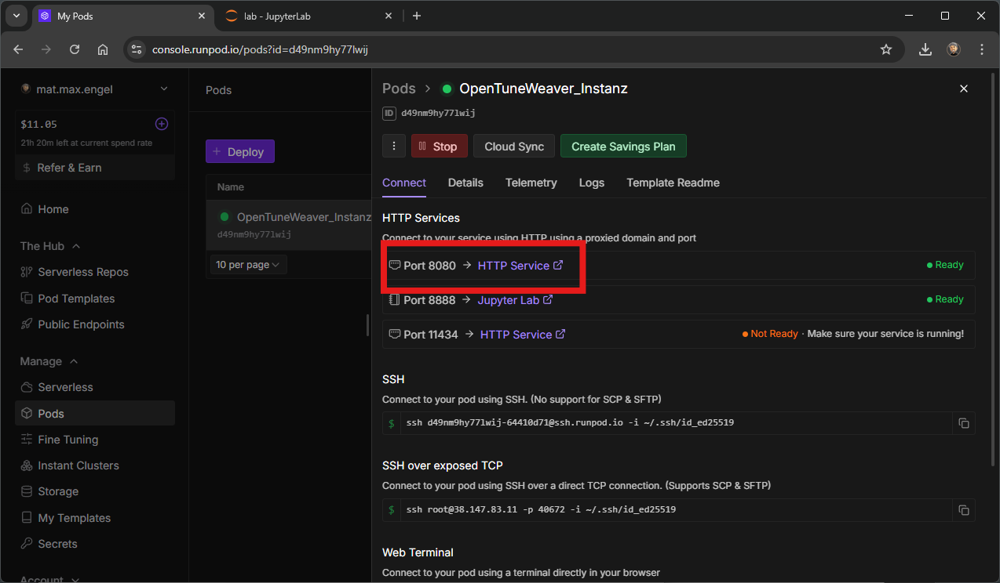
*Open the OTW UI on port 8080.*

The OTW landing page shows the eight pipeline stages and progress. Here you'll also see the quick settings for fine-tuning, which can be adjusted granularly in the Expert Settings tab. Files (docx, pdf, xlsx, txt, etc.) can be uploaded under the quick settings. Once everything is correct, the pipeline can be started. The refresh status shows the current status of the pipeline. This can be viewed in detail in the Terminal tab.


*Pipeline status and progress.*

---

## 5. Basic configuration in the UI
Enter a model name, paste the Hugging Face Access Token (READ), and choose a preset (e.g., “Production” with 8k seq‑len, 3 epochs, LoRA rank 16). Select desired export formats (LoRA, Merged, GGUF).

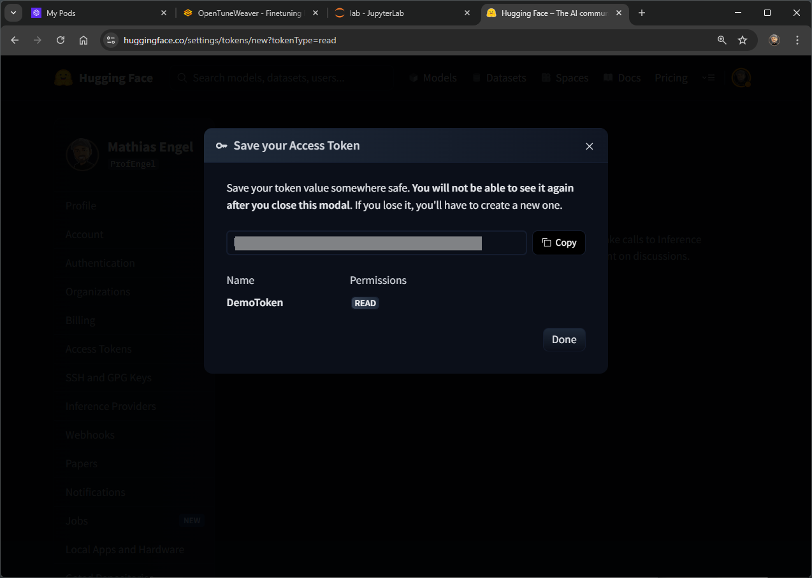
*Create/copy the HF Access Token.*

If no token exists yet, create one in the Hugging Face account settings and paste it into the token field.

1. Create an account on [huggingface.co](https://huggingface.co)
2. Go to [Settings > Access Tokens](https://huggingface.co/settings/tokens)
3. Create a new token with **Read** permission (and **Write** for model upload)
4. Note down the token for installation
---

## 6. Upload documents
Upload source files (PDF, DOCX, TXT, MD). OTW converts documents to high‑quality Markdown, generates semantic wiki entries, and builds Instruct‑QA pairs.

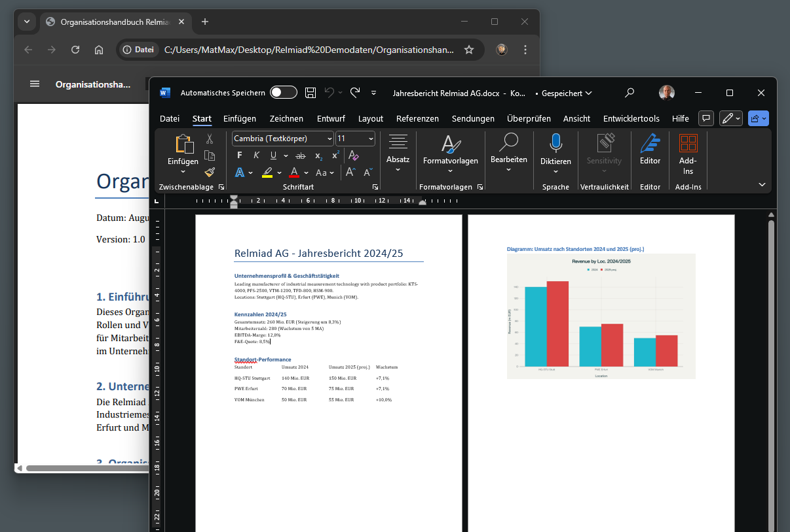
*Check your data (docx, xlsx,txt, etc.) and upload the to the pipeline.*

---

## 7. Run the pipeline
- Choose the desired steps (default: 1–8).
- Click “Start Pipeline”.

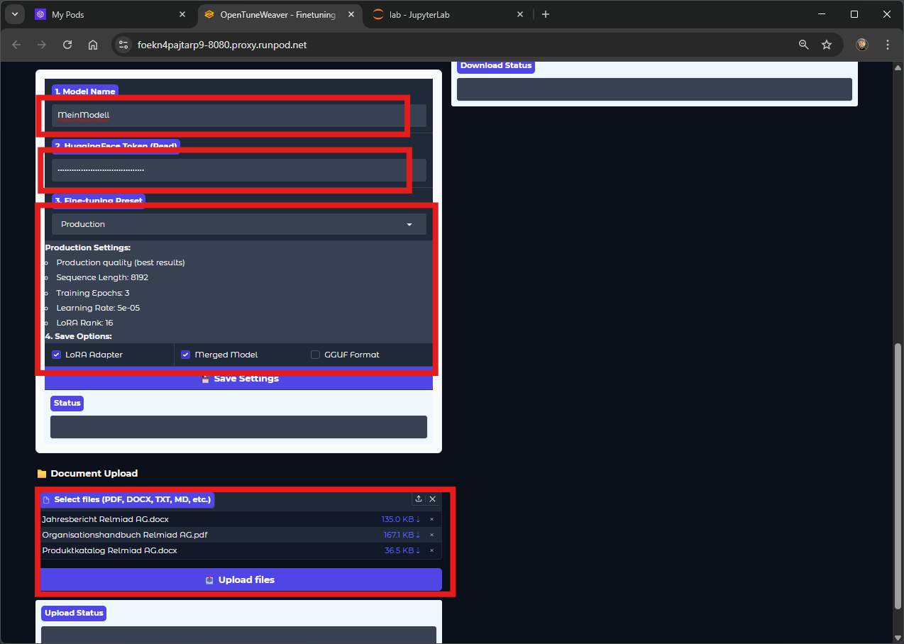
*All needed Changes for your finetuned model.*

OTW executes:
1. Document Conversion  
2. Wiki Generation (semantic chunking)  
3. Instruct‑QA Creation  
4. Dataset Formatting  
5. Benchmark Question Generation  
6. Fine‑Tuning (LoRA/QLoRA; GPU‑adaptive)  
7. Benchmarking  
8. Results Archive

Status, logs, and intermediate artifacts are visible in the UI. Curation can be performed between steps and runs can be repeated for quality.

---

---

## 7. Check the detailed status in the terminal-tab

The current status can be granularly refreshed at any time in the Terminal tab. This can also be done directly in the Jupyter Notebook terminal.

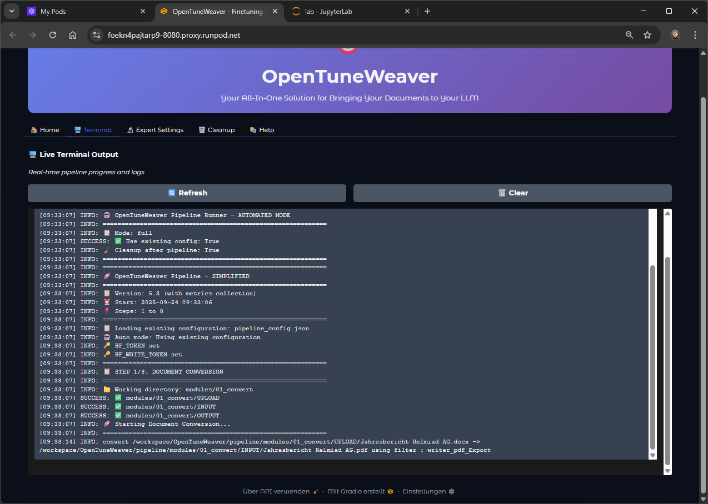
*Refresh the Terminal Tab or go to your Jupyter-Notebook-Terminal.*

---

## 8. Results and export
The run produces:
- Curated datasets (Wiki/QA), reports, and benchmarks.
- A trained model exported as:
  - LoRA adapter (lightweight, reusable),
  - Merged Transformers model (server‑friendly, e.g., vLLM),
  - GGUF (e.g., Q_8) for local UIs (LM Studio, OpenWebUI).
- Download links in the UI and optional upload to Hugging Face (with token).

---

## 9. Ports, logs, and tips
- Ports: 8888 (JupyterLab), 8080 (OTW UI), 11434 (Ollama).
- Restart scripts in `/workspace`:
  - `bash start_otw.sh` (UI)
  - `bash debug_otw.sh` (debug mode)
- Storage: Large PDFs/models require sufficient “Container Disk” and “Volume Disk”.
- GPU memory: For larger base models, reduce sequence length or batch sizes if needed.

---

## License and acknowledgments
- License: Apache‑2.0 (see repository).
- Thanks to the open‑source ecosystems around Transformers, Unsloth, Docling/Marker, Ollama, and others.

```