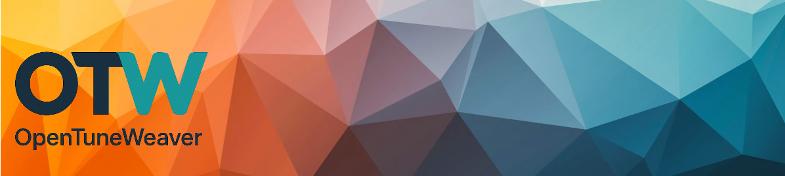
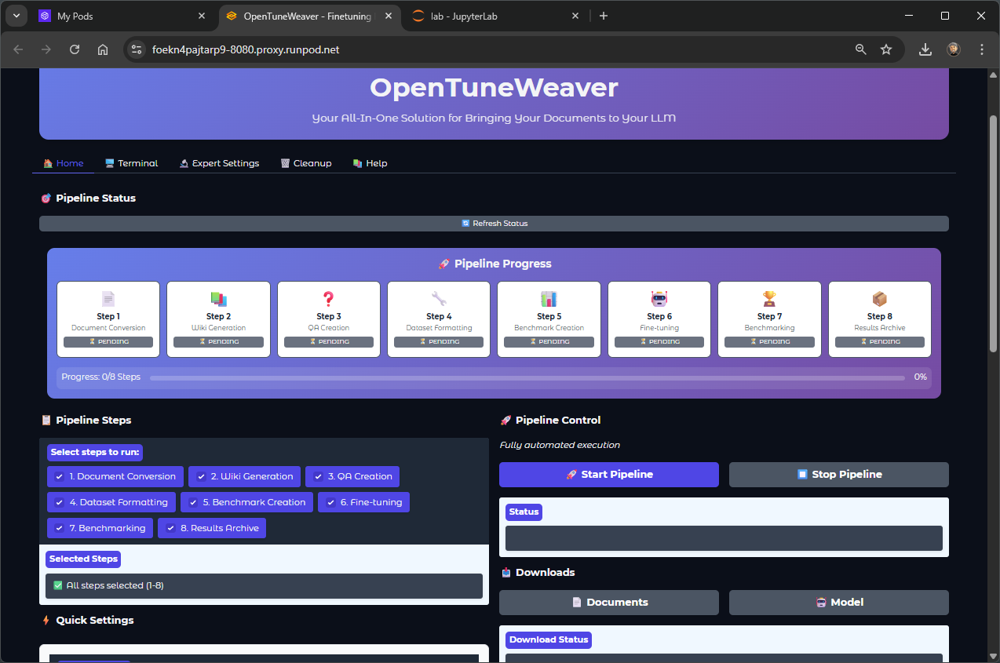
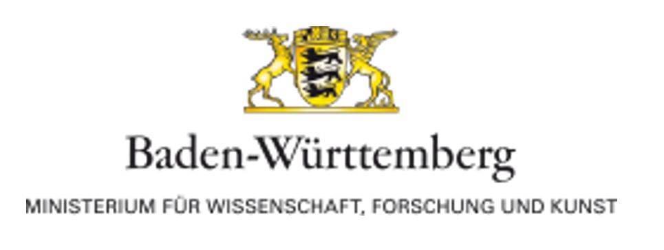
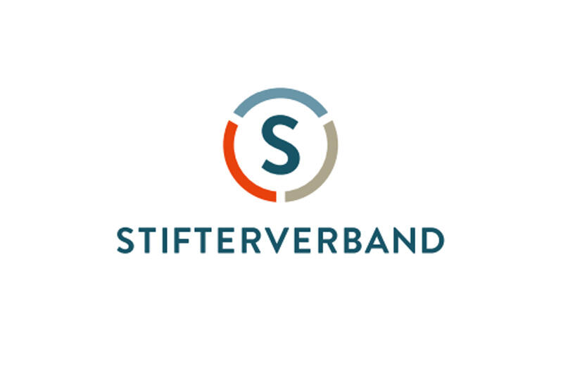

# OpenTuneWeaver 🧬


[](https://github.com/sponsors/ProfEngel)
[](https://www.youtube.com/user/MatMaxEngel)
[](https://opentuneweaver.com/)

<div align="center">
  
</div>


*Pipeline status and progress.*

**OpenTuneWeaver is a semantically-structured, curatable all-in-one LLM fine-tuning pipeline that automatically creates structured wiki entries, InstructQA datasets, and benchmarkable, deployment-ready models from any raw data (PDF, DOCX, etc.).** The system revolutionizes LLM fine-tuning through **semantic chunking**, **curatable dataset creation**, and **end-to-end automation** without requiring technical expertise.

<div align="right">
  
  
</div>

This project is part-funded by the **Ministry of Science, Research and Arts Baden-Württemberg (MWK)** and **Stifterverband Deutschland** as part of digital [Fellowship-Program](https://www.stifterverband.org/bwdigifellows/2024_engel_leiblein).


## 💖 Support OpenTuneWeaver

Help us democratize AI development for education and research! Your support enables us to continue building accessible, enterprise-grade AI tools that cost a fraction of traditional fine-tuning services (€5,000-€10,000+).

[](https://github.com/sponsors/ProfEngel)

**[Become a sponsor and join our mission!](https://github.com/sponsors/ProfEngel)** 🚀

> **🚀 Get Started with OpenTuneWeaver**
> 
> **✅ Free for Personal & Educational Use**  
> Perfect for researchers, students, and personal projects
>  
> **🎓 Academic Institutions**: Free for research and teaching activities
>
> **💼 Commercial Use?** → **(Enterprise Plan Required) see Github Sponsor** 
> ✅ Test it 30 days for free before you pay 
> 🎯 One-time payment with **1 year of updates included**  
> 🔄 Optional update extensions available after first year  
> 📞 Check out our Plans (down the page or in the Github Sponsor) for pricing & enterprise features
***


With the OTW-Viewer, all generated documents (converted Markdown files, lexicon wiki entries, QA instruct datasets, benchmark question datasets) can be read and curated as well as edited and saved back. Additionally, reports about the benchmark run and the pipeline run can be displayed.

## Key Features 🚀

- 🔄 **End-to-End Automation**: Only platform from PDF to deployment-ready, benchmarkable model in one workflow
- 🧠 **Semantic Wiki Chunking**: Revolutionary meaning-preserving segmentation instead of destructive fixed chunking  
- 📚 **Automatic Dataset Creation**: Wiki entries, InstructQA with 5 question types, benchmarks with ground truth
- 🎨 **Curatable Viewer Environment**: Interactive quality assurance with split/merge/annotation for all pipeline steps
- 📊 **Integrated Telemetry**: Real-time monitoring, metrics and audit trails for complete transparency
- 🤖 **GPU-Adaptive Training**: Automatic hardware optimization with LoRA/QLoRA for 100+ models
- 📱 **No-Code Gradio Interface**: Drag-&-drop upload with live terminal and complete pipeline control
- 🌐 **Multi-Format Export**: LoRA, Merged (both for transformers, vLLM, etc.), GGUF in Q_8 with quantizations for local deployment (OpenWebUI/LM-Studio)
- 🔍 **VLM Integration**: Vision-Language-Models for automatic image descriptions in documents
- ⚡ **Runpod Integration**: Scalable cloud GPU support for cost-effective training

***

## How to Install 🚀

Full Installation Guide here [Installation and Use-Guide](howto.md) or here...

### System Requirements

**Hardware:**
- **Linux system recommended** (Ubuntu 22.04 LTS or similar)
- **At least 100 GB free storage space**
- **NVIDIA GPU with at least 20 GB VRAM** (depending on the model being trained)
  - RTX 4090/A6000/A100 recommended
  - For smaller models: RTX 3090/4080 (16GB) possible
- **CUDA 12.8+ and cuDNN installed**

**Accounts:**
- **HuggingFace Account** with Access Token (Read + optional Write)

### HuggingFace Token Setup

1. Create an account on [huggingface.co](https://huggingface.co)
2. Go to [Settings > Access Tokens](https://huggingface.co/settings/tokens)
3. Create a new token with **Read** permission (and **Write** for model upload)
4. Note down the token for installation

### Quick Start with Runpod (Recommended)
This is how to work with Runpod. But you can also use this for your Local Server, as long as the requirements are done.

**Runpod Template:**
```

runpod/pytorch:2.8.0-py3.11-cuda12.8.1-cudnn-devel-ubuntu22.04
Disk Volume: 100 GB
Pod Volume:  100 GB
Open Ports: 8080,11434

```

**Installation:**
 Go to your pod and fire up the Jupyter Hub of the pod. Open a terminal window in the hub and put the following in.

```

cd /workspace
git clone https://github.com/ProfEngel/OpenTuneWeaver.git
cp OpenTuneWeaver/setup_with_ollama.sh .
chmod +x setup_with_ollama.sh
./setup_with_ollama.sh

```

 or better with venv

```

cd /workspace
git clone https://github.com/ProfEngel/OpenTuneWeaver.git
cp OpenTuneWeaver/setup_with_ollama_venv.sh .
chmod +x setup_with_ollama_venv.sh
./setup_with_ollama_venv.sh

```

**After installation:**
wait until the installation is done (approx. 5-10 min.), then press y for starting the ui. The ui starts on port http://your(runpod)IP:8080

In Runpod access via Runpod web interface on port 8080.

### Alternative Installation Methods

**Docker Installation:** *(Coming Soon)*
```

docker run -d -p 7860:7860 --gpus all -v opentuneweaver:/app/data --name opentuneweaver opentuneweaver/opentuneweaver:latest

```

**Conda Installation:**
```

conda create -n opentuneweaver python=3.11
conda activate opentuneweaver
apt-get update && apt-get upgrade -y
git clone https://github.com/ProfEngel/OpenTuneWeaver.git
cp OpenTuneWeaver/setup_with_ollama.sh .
chmod +x setup_with_ollama.sh

# Installation of unsloth_zoo from GitHub
pip install --upgrade --no-cache-dir --no-deps git+https://github.com/unslothai/unsloth-zoo.git

# now fire up the setup script
./setup_with_ollama.sh

```

**Virtual Environment:**
```

python3.11 -m venv opentuneweaver-env
source opentuneweaver-env/bin/activate
apt-get update && apt-get upgrade -y
git clone https://github.com/ProfEngel/OpenTuneWeaver.git
cp OpenTuneWeaver/setup_with_ollama.sh .
chmod +x setup_with_ollama.sh

# Installation of unsloth_zoo from GitHub
pip install --upgrade --no-cache-dir --no-deps git+https://github.com/unslothai/unsloth-zoo.git

# now fire up the setup script
./setup_with_ollama.sh

```

***

## What's Next? 🌟

**Short to medium-term roadmap:**
- 🌍 **Multilingual Support**: German, Spanish, French, additional languages
- 🌍 **Reasoning Model/ GPRO Support**: generating reasoning datasets and training in GPRO
- 🤖 **Extended Model Support**: 
  - GPT-OSS family (Reasoning with harmony-parsing and tokenization library)
  - Qwen 3.0 series
  - furthcoming SOTA OpenWeight or OpenSource LLM look here [ArtificalAnalysis AI](https://artificialanalysis.ai/)
- 🎨 **UI-Refresh**: Modern, robust, and cleaner user interface design
- 🐳 **Docker Support**: Simplified production deployment with containerization
- ⚙️ **User-friendly VLM/LLM Pipeline Switching**: Easy model selection and configuration within the pipeline
- 🌐 **OpenAI-API Compatible Platforms**: Support for alternative API providers beyond Ollama
- 🔗 **MCP-Server Integration**: OpenTuneWeaver as MCP-Server for direct chat integration and automation pipelines like n8n
- ⏱️ **Real-time Progress Tracking**: Live progress updates with remaining time estimates without page refresh
- 🎥 **YouTube Tutorials**: Comprehensive video tutorials on [MatMaxEngel YouTube Channel](https://www.youtube.com/user/MatMaxEngel) covering ongoing OTW updates and usage guides
- 📚 **Research Paper on OTW**: Detailed academic publication documenting OpenTuneWeaver's methodology, benchmarks, and educational applications
- 📊 **Advanced Analytics Dashboard**: Detailed training metrics and comparisons
- 🔧 **API Interface**: RESTful API for external integration
- 📱 **Mobile-optimized UI**: Responsive design for tablets and smartphones
- and many more. Stay tuned.

***

## Media Coverage & Interviews 📰

OpenTuneWeaver and our research on AI in education have gained significant media attention. Here are recent interviews and articles featuring Prof. Dr. Mathias Engel and the project:

### Recent Press Coverage

**⚡ [Lehr/Lernkonferenz 2025 - "Erprobung eines MoE und MultiAgenten – Chatbot als KI-Tutor für die Lehre"](https://www.lehrlernkonferenz-2025.de/programm)**  
*Lightning Talk: 09.10.2025*  
Lightning talk exploring the implementation of Mixture of Experts (MoE) and multi-agent chatbot systems as AI tutors in educational settings, presenting experimental results and practical applications.

**🎤 [HAWAII der GHD - "Level up! KI-Tutor „Käpsele" und trainiertes Sprachmodell „Hölderlin" im Multiplayer-Modus"](https://www.hochschuldidaktik.net/hawaii-25)**  
*Presentation: 26.09.2025*  
Conference presentation demonstrating advanced AI tutoring systems in multiplayer mode, featuring the "Käpsele" AI tutor and custom-trained "Hölderlin" language model for enhanced educational experiences.

**📰 [VDI Nachrichten - "Professor Chatbot hilft den Studierenden"](https://www.vdi-nachrichten.com/karriere/studium/professor-chatbot/)**  
*Published: 17.01.2025*  
Technical magazine article exploring how universities increasingly deploy artificial intelligence to enhance teaching quality, discussing both the potential and limitations of AI-powered learning assistance systems.

**📄 [Controlling & Management Review - "Generative KI im Controlling praktisch umsetzen"](https://www.springerprofessional.de/generative-ki-im-controlling-praktisch-umsetzen/51394852)**  
*Published: 01.08.2025*  
Reviewed paper discussing practical implementation of generative AI in controlling, showcasing real-world applications and methodologies for integrating AI solutions into business controlling processes.

**📰 [Nürtinger Zeitung - "Wie künstliche Intelligenz beim Studieren hilft"](https://www.ntz.de/nuertingen/artikel_hfwu-in-nuertingen-wie-kuenstliche-intelligenz-beim-studieren-hilft.html)**  
*Published: 03.12.2024*  
Feature article on how AI supports university studies, highlighting the collaborative research between Tobias Leiblein and Prof. Dr. Mathias Engel on developing AI tutoring systems and their impact on future education methods.

**📰 [Stuttgarter Zeitung - "Wie künstliche Intelligenz beim Lernen hilft"](https://www.stuttgarter-zeitung.de/inhalt.wissenschaftler-aus-nuertingen-wie-kuenstliche-intelligenz-beim-lernen-hilft.016cc0c8-debb-46b5-9fb4-8e99815dfcdb.html)**  
*Published: 23.09.2024*  
Article discussing how artificial intelligence assists in learning processes, featuring research from HfWU Nürtingen-Geislingen and addressing both opportunities and challenges that language models like ChatGPT present to academic teaching.

---

**Academic Impact:**  
These media appearances reflect the growing recognition of OpenTuneWeaver's innovative approach to democratizing AI fine-tuning for educational institutions and the broader implications of semantic chunking technology in knowledge management.

**Press Contact:**  
For additional interviews or press inquiries: [mathias@opentuneweaver.com](mailto:mathias@opentuneweaver.com)

## 💖 Sponsorship & Support

OpenTuneWeaver is committed to democratizing AI development while maintaining sustainability. Your support helps us continue building accessible, enterprise-grade tools at a fraction of traditional costs.

### 🎯 Community Support (Voluntary)

**Perfect for individuals, students, and researchers who want to support our mission:**

#### One-Time Donations
- **☕ Coffee for ProfEngel - $5**: Fuel late-night coding session for ProfEngel, the founder
- **☕ Coffee for the Team - $30**: Fuel late-night coding sessions
- **💻 Workstation Day - $110**: Power a full day of concentrated development  
- **🚀 GPU Hour Sponsor - $550**: Supercharge development with serious computational power

#### Monthly Support
- **☕ Coffee Supporter - $10/month**: Basic community support
- **📚 Education Champion - $25/month**: Enhanced educational resources access
- **🔬 Research Supporter - $50/month**: Early access to experimental features

### 🏢 Enterprise Licensing (Required for Commercial Use)

**Professional licensing for businesses and organizations using OpenTuneWeaver commercially:**

### 🏢 Enterprise Licensing (Required for Commercial Use)

**Professional licensing for businesses and organizations using OpenTuneWeaver commercially:**

#### 🥉 Bronze Enterprise - Small Companies
- **One-Time**: €499 (1 seat, 12 months updates)
- **Monthly**: €100/month (multi-seat usage)
- **Target:** Small companies (≤49 employees, ≤€1M annual revenue)
- Bronze company logo in README.md
- Commercial usage rights for qualifying small companies

#### 🥈 Silver Enterprise - Medium Companies  
- **One-Time**: €1,499 (3 seats, 12 months updates)
- **Monthly**: €300/month (extended teams)
- **Target:** Medium companies (50-249 employees, €1-50M annual revenue)
- Silver company logo in README.md + documentation
- Enhanced analytics and insights

#### 🥇 Gold Enterprise - Large Companies & Consultants
- **One-Time**: €4,999 (unlimited seats + client usage, 12 months updates)
- **Monthly**: €1,000/month (enterprise-scale)
- **Target:** Large companies (250+ employees or €50M+ annual revenue) & Consultants training LLMs for external clients
- Large premium logo placement in our ReadME.md
- Unlimited commercial usage including client projects
- Direct development roadmap influence

### Why These Prices Matter

Traditional LLM fine-tuning services cost **€5,000-€10,000+ per project**. OpenTuneWeaver provides enterprise-grade capabilities at a fraction of these costs, making advanced AI accessible to organizations of all sizes while supporting continued open-source development. OpenTuneWeaver is the first and only AllInOne-Solution for EndUsers to finetune your local LLM with all of your data.

**Ready to support democratized AI development?**  
[](https://github.com/sponsors/ProfEngel)

**Enterprise licensing questions?** Contact: mathias@opentuneweaver.com

## Project Overview(the hard facts about the project) 📊

### Technical Specifications
**📁 Repository Scale:**
- **71+ Files** across multiple languages and frameworks
- **Python:** 45 files (63.4%) - Core ML/AI pipeline
- **HTML:** 15 files (21.1%) - User interface components  
- **Shell:** 8 files (11.3%) - Deployment and setup scripts
- **Docker:** 3 files (4.2%) - Containerization support
- **8,265+ Lines of Code** - Enterprise-grade implementation

### Development Investment
**⏰ Timeline:**
- **80+ Development Days** already invested
- **91% Project Completion** achieved
- **3.2 Month Equivalent** full-time development effort

**🎯 Required Expertise:**
- Machine Learning/AI (LLM Fine-tuning, GPU-Optimization)
- Backend Development (Python, Pipeline Architecture)
- Frontend/UI (Gradio Interface, HTML/CSS)
- DevOps (Docker, Cloud Integration, Runpod)
- Document Processing (PDF-to-Markdown, VLM)
- Quality Assurance (Testing, Benchmarking)

### Project Value & Recognition
**🏆 Achievements:**
- **Funding:** MWK Baden-Württemberg + Stifterverband Deutschland
- **Dual Licensing:** Free for education, commercial licensing available
- **Unique Selling Point:** End-to-end PDF-to-Model pipeline automation
- **Media Recognition:** Featured in academic and technical publications
- **Market Position:** Leading solution in German educational sector

**💡 Why OpenTuneWeaver Matters:**
Traditional LLM fine-tuning services cost **€5,000-€10,000+ per project**. OpenTuneWeaver democratizes this technology, making enterprise-grade AI accessible to educational institutions and researchers at a fraction of traditional costs.

## License 📜

This project is licensed under the **Apache License 2.0**.

**Usage Rights:**
- ✅ **Private Use**: Completely free
- ✅ **Educational Institutions**: Free for research and teaching
- ✅ **Open Source Projects**: Free use with attribution
- ⚠️ **Commercial Use**: Enterprise license required

For commercial licensing, see our [sponsorship tiers above](#-sponsorship--support) or contact [mathias@opentuneweaver.com](mailto:mathias@opentuneweaver.com).

Full license terms can be found in the LICENSE file.

## Acknowledgments 🙏

OpenTuneWeaver would not be possible without these excellent open-source frameworks:

**Core Frameworks:**
- Unsloth - Efficient LLM fine-tuning
- Gradio - No-code web interface
- Transformers - HuggingFace Model Hub
- Ollama - Local LLM inference

**Document Processing:**
- Docling (IBM) - Intelligent PDF processing
- Marker - PDF-to-Markdown conversion

**Training & Optimization:**
- LoRA/QLoRA - Parameter-efficient fine-tuning
- BitsAndBytes - GPU quantization
- PEFT - Parameter-efficient fine-tuning

**Vision & Multimodal:**
- Google Gemma - Vision-Language models
- OpenAI GPT-OSS - Open Source LLM
- OpenAI CLIP - Image-text understanding

**Thanks to the entire open-source community!** 🎉

***

## Citation & Research 📚

If you use OpenTuneWeaver in your research, please cite our paper:

```

@article{opentuneweaver2025,
title={OpenTuneWeaver: Semantically-structured, Curatable LLM Fine-tuning Pipeline for Research and Education},
author={Engel, Prof. Dr. Mathias},
journal={arXiv preprint},
year={2024},
institution={Hochschule für Wirtschaft und Umwelt Nürtingen-Geislingen},
note={Funded by MWK Baden-Württemberg and Stifterverband Deutschland}
}

```

**Paper available:**
- 📄 [Local Version](docs/opentuneweaver-paper.pdf)
- 🌐 [ArXiv](https://arxiv.org/) *(Link follows after publication)*

***

## Support 💬

Do you have questions, suggestions, or need support?

- 🐛 **Issues**: [GitHub Issues](https://github.com/ProfEngel/OpenTuneWeaver/issues)
- 💬 **Discussions**: [GitHub Discussions](https://github.com/ProfEngel/OpenTuneWeaver/discussions)  
- 📧 **Enterprise Support**: [sales@opentuneweaver.com](mailto:sales@opentuneweaver.com)
- 🎓 **Academic Collaboration**: [research@opentuneweaver.com](mailto:research@opentuneweaver.com)

***

**Created by Prof. Dr. Mathias Engel 2023-2025** - Let's make OpenTuneWeaver even greater together! 💪

_Made with ❤️ in Stuttgart / Nürtingen, Germany_

***

## About

Semantically-structured, curatable all-in-one LLM fine-tuning pipeline

<div align="left">
  
</div>

**Prof. Dr. Mathias Engel - ProfEngel** 

<div align="left">
  
</div>
**Hochschule für Wirtschaft und Umwelt Nürtingen-Geislingen**  
*part-funded by MWK Baden-Württemberg and Stifterverband Deutschland*

## 🤝 Open for Contributions

Contributions are welcome!  
If you have ideas, improvements, or bug reports, feel free to open an **Issue** or submit a **Pull Request**.


## Star History
<a href="https://star-history.com/#ProfEngel/OpenTuneWeaver&Date">
  <picture>
    <source media="(prefers-color-scheme: dark)" srcset="https://api.star-history.com/svg?repos=ProfEngel/OpenTuneWeaver&type=Date&theme=dark" />
    <source media="(prefers-color-scheme: light)" srcset="https://api.star-history.com/svg?repos=ProfEngel/OpenTuneWeaver&type=Date" />
    
  </picture>
</a>


### Topics

`llm` `finetuning` `ai` `machine-learning` `nlp` `semantic-chunking` `lora` `qlora` `pdf-processing` `qa-generation` `benchmarking` `gradio` `huggingface` `educational-ai` `research-tools`
