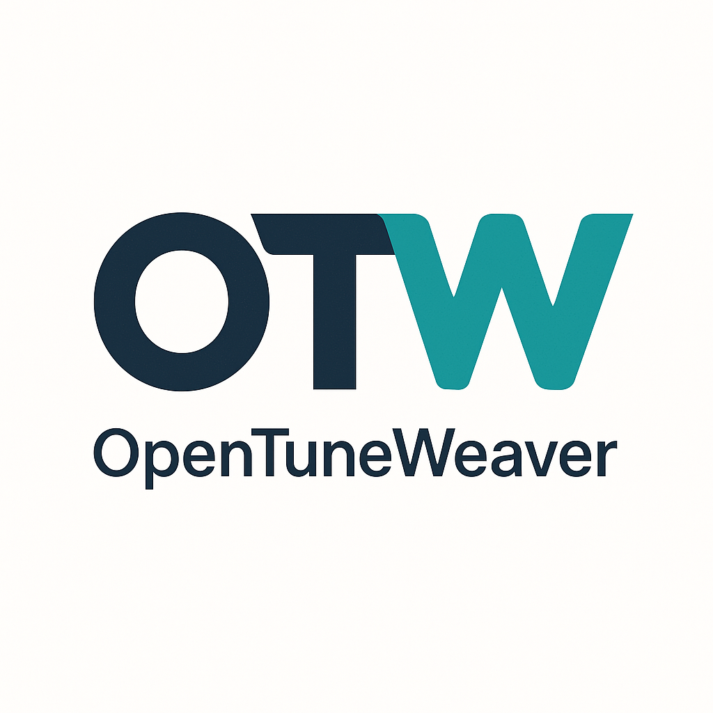

# OpenTuneWeaver 🧬


<div align="center">
  
</div>


**OpenTuneWeaver is a semantically-structured, curatable all-in-one LLM fine-tuning pipeline that automatically creates structured wiki entries, InstructQA datasets, and benchmarkable, deployment-ready models from any raw data (PDF, DOCX, etc.).** The system revolutionizes LLM fine-tuning through **semantic chunking**, **curatable dataset creation**, and **end-to-end automation** without requiring technical expertise.

This project is part-funded by the **Ministry of Science, Research and Arts Baden-Württemberg (MWK)** and **Stifterverband Deutschland** as part of digital fellowship program   [Fellowship-Program](https://www.stifterverband.org/bwdigifellows/2024_engel_leiblein).

> **Tip**  
> **Looking for an [Enterprise Plan](mailto:sales@opentuneweaver.com)?** – **Speak with Our Sales Team Today!**  
> Get **enhanced capabilities**, including **custom theming and branding**, **Service Level Agreement (SLA) support**, **Long-Term Support (LTS) versions**, **priority support**, **on-premise deployment**, and **more!**

***


With this viewer, all generated documents (converted Markdown files, lexicon wiki entries, QA instruct datasets, benchmark question datasets) can be read and curated as well as edited and saved back. Additionally, reports about the benchmark run and the pipeline run can be displayed.

## Key Features 🚀

- 🔄 **End-to-End Automation**: Only platform from PDF to deployment-ready, benchmarkable model in one workflow
- 🧠 **Semantic Wiki Chunking**: Revolutionary meaning-preserving segmentation instead of destructive fixed chunking  
- 📚 **Automatic Dataset Creation**: Wiki entries, InstructQA with 5 question types, benchmarks with ground truth
- 🎨 **Curatable Viewer Environment**: Interactive quality assurance with split/merge/annotation for all pipeline steps
- 📊 **Integrated Telemetry**: Real-time monitoring, metrics and audit trails for complete transparency
- 🤖 **GPU-Adaptive Training**: Automatic hardware optimization with LoRA/QLoRA for 100+ models
- 📱 **No-Code Gradio Interface**: Drag-&-drop upload with live terminal and complete pipeline control
- 🌐 **Multi-Format Export**: LoRA, Merged (both for transformers, vLLM, etc.), GGUF in Q_8 with quantizations for local deployment (OpenWebUI/LM-Studio)
- 🔍 **VLM Integration**: Vision-Language-Models for automatic image descriptions in documents
- ⚡ **Runpod Integration**: Scalable cloud GPU support for cost-effective training

***

## How to Install 🚀

### System Requirements

**Hardware:**
- **Linux system recommended** (Ubuntu 22.04 LTS or similar)
- **At least 100 GB free storage space**
- **NVIDIA GPU with at least 20 GB VRAM** (depending on the model being trained)
  - RTX 4090/A6000/A100 recommended
  - For smaller models: RTX 3090/4080 (16GB) possible
- **CUDA 12.8+ and cuDNN installed**

**Accounts:**
- **HuggingFace Account** with Access Token (Read + optional Write)

### HuggingFace Token Setup

1. Create an account on [huggingface.co](https://huggingface.co)
2. Go to [Settings > Access Tokens](https://huggingface.co/settings/tokens)
3. Create a new token with **Read** permission (and **Write** for model upload)
4. Note down the token for installation

### Quick Start with Runpod (Recommended)

**Runpod Template:**
```

runpod/pytorch:2.8.0-py3.11-cuda12.8.1-cudnn-devel-ubuntu22.04
Disk Volume: 100 GB
Pod Volume:  100 GB
Open Ports: 8080,11434

```

**Installation:**
```

cd /workspace
git clone https://github.com/ProfEngel/OpenTuneWeaver.git
cp OpenTuneWeaver/setup_runpod_direct.sh .
chmod +x setup_runpod_direct.sh
./setup_runpod_direct.sh

```

**After installation:**

wait until the installation is done, then press y for starting the ui. The ui starts on port http://yourip:8080

In Runpod access via Runpod web interface on port 8080.

### Alternative Installation Methods

**Docker Installation:** *(Coming Soon)*
```

docker run -d -p 7860:7860 --gpus all -v opentuneweaver:/app/data --name opentuneweaver opentuneweaver/opentuneweaver:latest

```

**Conda Installation:** *(Coming Soon)*
```

conda create -n opentuneweaver python=3.11
conda activate opentuneweaver
git clone https://github.com/ProfEngel/OpenTuneWeaver.git
cp OpenTuneWeaver/setup_runpod_direct.sh .
chmod +x setup_runpod_direct.sh
./setup_runpod_direct.sh

```

**Virtual Environment:** *(Coming Soon)*
```

python3.11 -m venv opentuneweaver-env
source opentuneweaver-env/bin/activate
git clone https://github.com/ProfEngel/OpenTuneWeaver.git
cp OpenTuneWeaver/setup_runpod_direct.sh .
chmod +x setup_runpod_direct.sh
./setup_runpod_direct.sh

```

***

## What's Next? 🌟

**Short to medium-term roadmap:**
- 🌐 **English Localization**: Complete UI and documentation in English
- 🌍 **Multilingual Support**: Spanish, French, additional languages
- 🤖 **Extended Model Support**: 
  - GPT-OSS family
  - Qwen 2.5/3.0 series  
  - Mixtral and other MoE models
  - Phi-4 and Microsoft models
- 📊 **Advanced Analytics Dashboard**: Detailed training metrics and comparisons
- 🔧 **API Interface**: RESTful API for external integration
- 📱 **Mobile-optimized UI**: Responsive design for tablets and smartphones

See our complete [Roadmap](docs/roadmap.md) for detailed information.

***

## License 📜

This project is licensed under the **Apache License 2.0**. 

**Usage Rights:**
- ✅ **Private Use**: Completely free
- ✅ **Educational Institutions**: Free for research and teaching
- ✅ **Open Source Projects**: Free use with attribution
- ⚠️ **Commercial Use**: Enterprise plan required

For commercial use, contact our [Sales Team](mailto:sales@opentuneweaver.com) for an Enterprise Plan.

Full license terms can be found in the [LICENSE](LICENSE) file.

***

## Acknowledgments 🙏

OpenTuneWeaver would not be possible without these excellent open-source frameworks:

**Core Frameworks:**
- [Unsloth](https://github.com/unslothai/unsloth) - Efficient LLM fine-tuning
- [Gradio](https://gradio.app/) - No-code web interface
- [Transformers](https://github.com/huggingface/transformers) - HuggingFace Model Hub
- [Ollama](https://ollama.ai/) - Local LLM inference

**Document Processing:**
- [Docling (IBM)](https://github.com/DS4SD/docling) - Intelligent PDF processing
- [Marker](https://github.com/VikParuchuri/marker) - PDF-to-Markdown conversion

**Training & Optimization:**
- [LoRA/QLoRA](https://github.com/microsoft/LoRA) - Parameter-efficient fine-tuning
- [BitsAndBytes](https://github.com/TimDettmers/bitsandbytes) - GPU quantization
- [PEFT](https://github.com/huggingface/peft) - Parameter-efficient fine-tuning

**Vision & Multimodal:**
- [Google Gemma](https://ai.google.dev/gemma) - Vision-Language models
- [OpenAI CLIP](https://github.com/openai/CLIP) - Image-text understanding

**Thanks to the entire open-source community!** 🎉

***

## Citation & Research 📚

If you use OpenTuneWeaver in your research, please cite our paper:

```

@article{opentuneweaver2024,
title={OpenTuneWeaver: Semantically-structured, Curatable LLM Fine-tuning Pipeline for Research and Education},
author={Engel, Prof. Dr. Mathias},
journal={arXiv preprint},
year={2024},
institution={Hochschule für Wirtschaft und Umwelt Nürtingen-Geislingen},
note={Funded by MWK Baden-Württemberg and Stifterverband Deutschland}
}

```

**Paper available:**
- 📄 [Local Version](docs/opentuneweaver-paper.pdf)
- 🌐 [ArXiv](https://arxiv.org/) *(Link follows after publication)*

***

## Support 💬

Do you have questions, suggestions, or need support?

- 🐛 **Issues**: [GitHub Issues](https://github.com/ProfEngel/OpenTuneWeaver/issues)
- 💬 **Discussions**: [GitHub Discussions](https://github.com/ProfEngel/OpenTuneWeaver/discussions)  
- 📧 **Enterprise Support**: [sales@opentuneweaver.com](mailto:sales@opentuneweaver.com)
- 🎓 **Academic Collaboration**: [research@opentuneweaver.com](mailto:research@opentuneweaver.com)

***

**Created by Prof. Dr. Mathias Engel 2023-2025** - Let's make OpenTuneWeaver even greater together! 💪

***

## About

Semantically-structured, curatable all-in-one LLM fine-tuning pipeline

**Hochschule für Wirtschaft und Umwelt Nürtingen-Geislingen**  
*Funded by MWK Baden-Württemberg and Stifterverband Deutschland*

## Star History
<a href="https://star-history.com/#ProfEngel/OpenTuneWeaver&Date">
  <picture>
    <source media="(prefers-color-scheme: dark)" srcset="https://api.star-history.com/svg?repos=ProfEngel/OpenTuneWeaver&type=Date&theme=dark" />
    <source media="(prefers-color-scheme: light)" srcset="https://api.star-history.com/svg?repos=ProfEngel/OpenTuneWeaver&type=Date" />
    
  </picture>
</a>


### Topics

`llm` `finetuning` `ai` `machine-learning` `nlp` `semantic-chunking` `lora` `qlora` `pdf-processing` `qa-generation` `benchmarking` `gradio` `huggingface` `educational-ai` `research-tools`
